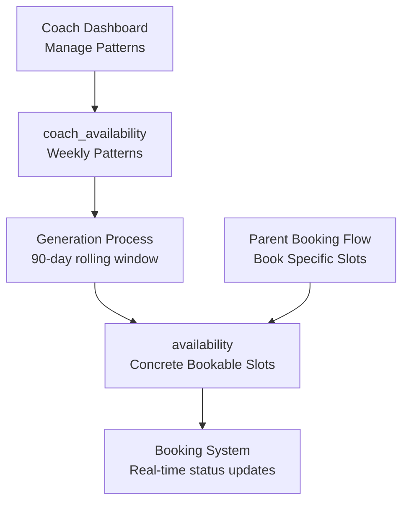

# Availability Tables Architecture Documentation

## Overview
The Empire Performance Coaching system uses a two-tier availability architecture to handle coach scheduling and real-time booking management. This document clarifies the relationship, data flow, and synchronization between the `coach_availability` and `availability` tables.

## Table Architecture

### 1. `coach_availability` Table - **Template/Pattern Definition**

**Purpose**: Defines recurring weekly availability patterns for coaches across different locations.

```sql
CREATE TABLE coach_availability (
    id UUID PRIMARY KEY DEFAULT gen_random_uuid(),
    coach_id UUID REFERENCES user_profiles(id) ON DELETE CASCADE,
    day_of_week INTEGER NOT NULL CHECK (day_of_week >= 0 AND day_of_week <= 6), -- 0=Sunday, 1=Monday, etc.
    start_time TIME NOT NULL,
    end_time TIME NOT NULL,
    location TEXT NOT NULL,
    is_active BOOLEAN DEFAULT true,
    created_at TIMESTAMPTZ DEFAULT CURRENT_TIMESTAMP,
    updated_at TIMESTAMPTZ DEFAULT CURRENT_TIMESTAMP
);
```

**Key Characteristics**:
- **Static/Template Data**: Represents repeating weekly patterns
- **Location-Based**: Each record represents availability at a specific location
- **Time-Based**: Uses `day_of_week` (0-6) and `TIME` fields for recurring patterns
- **Management Interface**: Coaches modify this table through their dashboard
- **Pattern Examples**:
  - "Every Monday 9:00-12:00 at Lochwinnoch"
  - "Tuesday/Thursday 14:00-18:00 at Airdrie"

### 2. `availability` Table - **Concrete Bookable Slots**

**Purpose**: Contains specific, date-time based slots that can be booked by parents, generated from coach availability patterns.

```sql
CREATE TABLE availability (
    id UUID PRIMARY KEY DEFAULT gen_random_uuid(),
    coach_id UUID REFERENCES user_profiles(id) ON DELETE CASCADE,
    location_id UUID REFERENCES locations(id) ON DELETE CASCADE,
    starts_at TIMESTAMPTZ NOT NULL,  -- Specific date and time
    ends_at TIMESTAMPTZ NOT NULL,    -- Specific date and time
    status TEXT DEFAULT 'open' CHECK (status IN ('open', 'booked', 'blocked')),
    created_at TIMESTAMPTZ DEFAULT CURRENT_TIMESTAMP,
    updated_at TIMESTAMPTZ DEFAULT CURRENT_TIMESTAMP
);
```

**Key Characteristics**:
- **Dynamic/Concrete Data**: Specific timestamps for actual booking
- **Status Management**: Tracks booking state (open/booked/blocked)
- **Rolling Window**: Covers next 90 days from current date
- **Booking Interface**: Parents see and book from this table
- **Real-time Updates**: Status changes immediately upon booking

## Data Relationship & Flow

### Generation Process: Template → Concrete Slots



### Example Data Flow

1. **Coach Sets Pattern** (in `coach_availability`):
   ```sql
   INSERT INTO coach_availability VALUES (
       coach_id: 'uuid-jack-haggerty',
       day_of_week: 1,  -- Monday
       start_time: '09:00',
       end_time: '12:00',
       location: 'Lochwinnoch — Lochbarr Services Leisure Centre',
       is_active: true
   );
   ```

2. **System Generates Concrete Slots** (in `availability`):
   ```sql
   -- For the next 90 days, every Monday 9-12 at Lochwinnoch
   INSERT INTO availability VALUES
   (coach_id: 'uuid-jack-haggerty', location_id: 'uuid-lochwinnoch',
    starts_at: '2025-01-20 09:00:00+00', ends_at: '2025-01-20 12:00:00+00', status: 'open'),
   (coach_id: 'uuid-jack-haggerty', location_id: 'uuid-lochwinnoch',
    starts_at: '2025-01-27 09:00:00+00', ends_at: '2025-01-27 12:00:00+00', status: 'open'),
   -- ... continuing for 90 days
   ```

3. **Parent Books Slot**:
   ```sql
   UPDATE availability
   SET status = 'booked'
   WHERE id = 'specific-slot-uuid';
   ```

## Current Implementation Details

### Data Volume
- **coach_availability**: ~812 base patterns (29 coaches × 7 days × 4 locations)
- **availability**: ~8,000 concrete slots (90-day rolling window)

### Time Slot Structure
Based on migration analysis, the system generates:
- **Monday-Friday**:
  - Morning: 9:00-12:00 (3 hourly slots: 9-10, 10-11, 11-12)
  - Afternoon: 14:00-18:00 (4 hourly slots: 14-15, 15-16, 16-17, 17-18)
  - Evening (weekdays only): 18:00-20:00 (2 hourly slots: 18-19, 19-20)
- **Saturday**: Morning only: 9:00-13:00 (4 hourly slots)
- **Sunday**: Limited availability

### Location Mapping
The system handles location references differently in each table:
- **coach_availability**: Uses `location` TEXT field with full location names
- **availability**: Uses `location_id` UUID field referencing `locations` table

## Synchronization Logic

### Automatic Generation Process
```sql
-- Simplified generation logic (from migrations)
DO $$
DECLARE
    coach_record RECORD;
    location_record RECORD;
    day_counter INTEGER;
    hour_counter INTEGER;
    current_date DATE;
BEGIN
    -- Loop through each coach
    FOR coach_record IN SELECT id FROM coaches LOOP
        -- Loop through each location
        FOR location_record IN SELECT id, name FROM locations LOOP
            -- Generate 90 days of availability
            current_date := CURRENT_DATE;
            WHILE current_date <= CURRENT_DATE + INTERVAL '90 days' LOOP
                -- Skip Sundays for most availability
                IF EXTRACT(DOW FROM current_date) != 0 THEN
                    -- Generate hourly slots based on coach_availability patterns
                    INSERT INTO availability (...) VALUES (...);
                END IF;
                current_date := current_date + INTERVAL '1 day';
            END LOOP;
        END LOOP;
    END LOOP;
END $$;
```

### Status Management
- **open**: Available for booking
- **booked**: Reserved by a parent, linked to session creation
- **blocked**: Temporarily unavailable (coach absence, maintenance, etc.)

## Database Functions

### Key Functions for Availability Management

1. **get_coach_availability()**: Queries bookable slots
   ```sql
   SELECT availability_id, coach_id, coach_name, location_id, location_name,
          starts_at, ends_at, status
   FROM availability a
   JOIN user_profiles up ON a.coach_id = up.id
   JOIN locations l ON a.location_id = l.id
   WHERE status = 'open' AND starts_at > NOW()
   ORDER BY starts_at;
   ```

2. **book_session()**: Transactional booking with availability locking
   ```sql
   -- Locks availability record, creates session, updates status to 'booked'
   ```

## API Integration Points

### For Coach Dashboard
```javascript
// Coaches manage their weekly patterns
const updateCoachAvailability = async (coachId, availabilityPattern) => {
  // Updates coach_availability table
  // Triggers regeneration of availability slots
};
```

### For Parent Booking Flow
```javascript
// Parents book specific time slots
const getAvailableSlots = async (locationId, date, coachId) => {
  // Queries availability table with filters
  return await supabase.rpc('get_coach_availability', {
    p_location_id: locationId,
    p_date: date,
    p_coach_id: coachId
  });
};
```

## Performance Considerations

### Indexes
```sql
-- Performance indexes for availability queries
CREATE INDEX idx_availability_location_date ON availability (location_id, starts_at, status);
CREATE INDEX idx_coach_availability_coach_id ON coach_availability (coach_id);
CREATE INDEX idx_coach_availability_day_location ON coach_availability (day_of_week, location);
CREATE INDEX idx_coach_availability_active ON coach_availability (is_active);
```

### Query Optimization
- **Composite indexes** for multi-column queries
- **Filtered queries** using `status = 'open'` and `starts_at > NOW()`
- **Date range queries** for calendar view efficiency

## Data Consistency Rules

### Synchronization Requirements
1. **Pattern Changes**: When `coach_availability` is modified, future `availability` slots must be regenerated
2. **Location Changes**: Updates to locations must cascade to both tables
3. **Coach Deactivation**: Setting `coach_availability.is_active = false` should block future `availability` generation
4. **Booking Conflicts**: The system must prevent double-booking through proper locking mechanisms

### Data Integrity Checks
```sql
-- Ensure no overlapping availability slots for same coach
CREATE UNIQUE INDEX idx_availability_no_overlap
ON availability (coach_id, starts_at, ends_at);

-- Ensure coach_availability patterns don't conflict
CREATE UNIQUE INDEX idx_coach_availability_unique_pattern
ON coach_availability (coach_id, day_of_week, start_time, end_time, location);
```

## Migration & Maintenance

### Rolling Window Maintenance
The system should regularly:
1. **Generate new slots**: Add availability for dates approaching the 90-day window
2. **Archive old slots**: Remove or archive past availability records
3. **Clean up conflicts**: Resolve any synchronization issues between tables

### Best Practices
1. **Atomic Updates**: Use transactions when modifying patterns that affect multiple slots
2. **Status Validation**: Ensure status changes follow valid state transitions
3. **Audit Trail**: Log changes to availability patterns for troubleshooting
4. **Performance Monitoring**: Track query performance on high-volume availability searches

---

## Summary

The two-table architecture provides:
- **Flexibility**: Coaches can set complex recurring patterns
- **Performance**: Optimized queries for real-time booking
- **Scalability**: Clear separation between pattern management and booking execution
- **Data Integrity**: Proper relationships and constraints prevent conflicts

This architecture supports the business requirements while maintaining system performance and data consistency across the coaching platform.